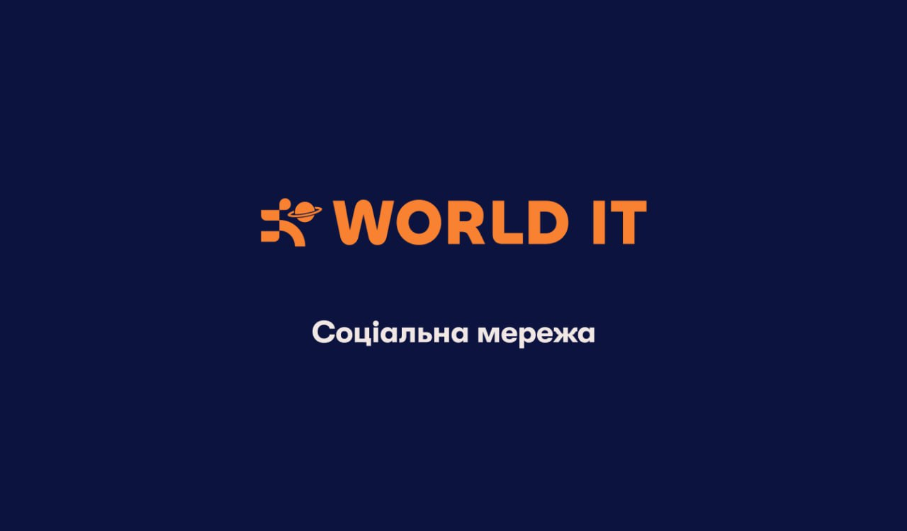

# Project "World.It-Messenger"

## Navigation | Навігація:
> [!TIP]
> - [Team Members | Delevopers](#team-members--delevopers--склад-команді)
> - [Purpose of creating the project](#purpose-of-creating-the-project--мета-створення-проекту)
> - [Technologies](#technologies--технології)
> - [Why Project "World.IT-Messenger" if useful](#why-project-worldit-messenger-if-useful--чому-проект-worldit-messenger-корисний)
> - [Design & Structure of project](#design--structure-of-project--дизайн-та-струтура-проекту)
> - [Functionality of each application](#functionality-of-each-application--функціонал-кожного-додатка)
> - [How to launch a project on your own PC](#how-to-launch-a-project-on-your-own-pc--як-самостійно-запустити-проект-на-власному-компютері)
> - [Conlusion](#conlusion--висновок)
____
> [!TIP]
> - [Склад команді](#team-members--delevopers--склад-команді)
> - [Мета створення проекту](#purpose-of-creating-the-project--мета-створення-проекту)
> - [Технології](#technologies--технології)
> - [Чому Проект "World.IT-Messenger" корисний](#why-project-worldit-messenger-if-useful--чому-проект-worldit-messenger-корисний)
> - [Дизайн та структура проекту](#design--structure-of-project--дизайн-та-струтура-проекту)
> - [Функціонал кожного додатка](#functionality-of-each-application--функціонал-кожного-додатка)
> - [Як самостійно запустити проект на власному комп'ютері](#how-to-launch-a-project-on-your-own-pc--як-самостійно-запустити-проект-на-власному-компютері)
> - [Висновок](#conlusion--висновок)
## Team Members | Delevopers | Склад команді:
- [__Shramko Ilia__](https://github.com/IllyaShramko/World.IT-Messenger) - __Teamlead__
- [__Halkin Yehor__](https://github.com/EgorGalkinORG/Worldit-Messager)
- [__Petrenko Davyd__](https://github.com/Davidptn/WorldIt_Messenger)
- [__Koshel' Timur__](https://github.com/kosheltimur)
____
- [__Шрамко Іл'я__](https://github.com/IllyaShramko/World.IT-Messenger) - __Teamlead__
- [__Галкін Єгор__](https://github.com/EgorGalkinORG/Worldit-Messager)
- [__Петренко Давид__](https://github.com/Davidptn/WorldIt_Messenger)
- [__Кошель Тимур__](https://github.com/kosheltimur)

## Purpose of creating the project | Мета створення проекту:
### EN:
The purpose of creating this project is to practice & improve the newly learned skills of Django Framework: Django Forms, Django Class Views, Django channels (for working with WebSocket), ajax (jquery) for sending data to the backend in real time with an instant response from the server, as well as working with the iso date format to format it in local time.
____
### UA:
Мета створення цього проекту - вдосконалення навичок, які ми щонедавно почали вивчати у фреймворці Django: Django Forms, Django Class Views, Django channels (Для праці з WebSocket), ajax (jquery) для відправки даних на бек-енд у реальному часі з мгновеною відповіддю від серверу, а також робота з iso-форматом дат для форматування його у локальний час
## Technologies | Технології:
> [!NOTE]
> - Django (Python framework)
> - pillow (Python module)
> - os (Python module)
> - daphne (Python module for async work)
> - base64 (Python module for decode images)
> - channels (Python module for websockets)
> - SQLite (Database)
> - Jquery 
> - Ajax
> - WebSocket
> - Figma (Design)
> - git 
> - GitHub
## Why Project "World.IT-Messenger" if useful | Чому Проект "World.IT-Messenger" корисний:
### EN:
- You can write & publish your ideas, thoughts and emotions
- You can create albums & upload photo in them, also you can hide any albums if you want it
- You can send a friend invitation to any user, you can also delete any user who has become your friend
- You can create groups with your friends & manage them, also you can delete any group if you is admin of group
- You can chatting with your friends in your group or personal chat in real time!
- Also you can send messeges with any photo which you upload
- You can change any your account settings: first name, surname, avatar, email, password etc.
____
### UA:
- Ви можете записувати та публікувати свої ідеї, думки та емоції.
- Ви можете створювати альбоми та завантажувати в них фотографії, а також можете приховувати будь-які альбоми, якщо хочете.
- Ви можете надіслати запрошення до друзів будь-якому користувачеві, а також видалити будь-якого користувача, який став вашим другом.
- Ви можете створювати групи зі своїми друзями та керувати ними, а також можете видалити будь-яку групу, якщо ви є адміністратором групи.
- Ви можете спілкуватися з друзями у своїй групі або особистому чаті в режимі реального часу!
- Також ви можете надсилати повідомлення з будь-якою фотографією, яку завантажуєте.
- Ви можете змінити будь-які налаштування свого облікового запису: ім'я, прізвище, аватар, електронну пошту, пароль тощо.

## Design & Structure of project | Дизайн та струтура проекту:
-  [Figma Design](https://www.figma.com/design/20TZphWNufeAQYOe7E1sze/%D0%A1%D0%BE%D1%86%D1%96%D0%B0%D0%BB%D1%8C%D0%BD%D0%B0-%D0%BC%D0%B5%D1%80%D0%B5%D0%B6%D0%B0-World-IT?node-id=6-26&t=6FcZEGOAfhm7mSQr-1)
-  [FigJam Structure Project](https://www.figma.com/board/mj00RE7J6heFJIns5p0ybI/Untitled?node-id=0-1&p=f&t=f77Z4xYiwBP9IkS4-0)
____
-  [Фігма Дизайн](https://www.figma.com/design/20TZphWNufeAQYOe7E1sze/%D0%A1%D0%BE%D1%86%D1%96%D0%B0%D0%BB%D1%8C%D0%BD%D0%B0-%D0%BC%D0%B5%D1%80%D0%B5%D0%B6%D0%B0-World-IT?node-id=6-26&t=6FcZEGOAfhm7mSQr-1)
-  [Фігджєм Структура Проекту](https://www.figma.com/board/mj00RE7J6heFJIns5p0ybI/Untitled?node-id=0-1&p=f&t=f77Z4xYiwBP9IkS4-0)

## Functionality of each application | Функціонал кожного додатка:
<details>
  <summary><b>📁 Home_app</b></summary>
  
  ---
  > 🏠 Home_app is the home page where you can find the main information about yourself and other users. You can also create a new post and attach several images to it on the topic of the post.
  --- 
  > 🏠 Home_app - це головна сторінка, де розміщується головна інформація, як про вас, так і про інших користувачів. Також на головній ви можете створити новий пост та прикріпити до нього декілька зображень на тему поста.
  ---
</details>

<details>
  <summary><b>📁 User_app</b></summary>
  
  ---
  > 👤 User_app - This application is responsible for registration, authorization, and logout. With it's help, you can see the registration and authorization pages.
  --- 
  > 👤 User_app - Цей додаток відповідає за реєстрацію, авторизацію та вихід з аккаунту. За допомогу ньому ви можете бачити сторінкі реєстрації та авторизації.
  ---
</details>

<details>
  <summary><b>📁 Chat_app</b></summary>
  
  ---
  > 💬 Chat_app - This is the main page of chats and chats themselves. By going to any chat, in the contact list, or on the right in the group list, you can write to other users and send any photos in real time using WebSocket. Also, if you are a group administrator, you can edit the name, avatar, and group users.
  
  > To send a message with an attached image, we wrote the following code snippet:
  On the frontend in __chat.js__:
  ```js
    const reader = new FileReader();
    reader.onload = function(event){
        webSocket.send(JSON.stringify({
            'message': messageText,
            'img':reader.result.split(',')[1],
            'imgType':file.type.split('/')[1]
        }))
        document.getElementById("attaImg").src = ''
    }
    reader.readAsDataURL(file) 
  ```
  > Here we receive a message and an image, which we send in bits to the backend
  __consumers.py__:
  ```python
    @database_sync_to_async
    def save_message_to_db(self, text_data):
        data = json.loads(text_data)
        message_text = str(data["message"])
        try:
            img = base64.b64decode(data.get('img'))
            img_type = data.get('imgType')
            django_file = ContentFile(img, name=f'fileo.{img_type}')
            return ChatMessage.objects.create(
                content=message_text,
                author=Profile.objects.get(user=self.scope['user']),
                chat_group=ChatGroup.objects.get(pk=self.room_group_name),
                attached_image = django_file
            )
        except:
            return ChatMessage.objects.create(
                content=message_text,
                author=Profile.objects.get(user=self.scope['user']),
                chat_group=ChatGroup.objects.get(pk=self.room_group_name)
            )
  ```
  > Here we get our message and its properties from text_data. Then we try to decode the image, if there is none we create a standard message without the image. If the decoding is successful, we create a file object with its name and type. We pass this file object to attached_image
  --- 
  > 💬 Chat_app - Це головна сторінка чатів та саме чати. Перейшовши в будь-який чат, у списку контактів, або справа у списку груп, ви можете писати іншим користувачам та відправляти будь-які фото у реальному часі за допомогую WebSocket. Також ви, якщо є адміністратором групи, можете редагувати ім'я, аватар, користувачів групи.
  
  > Щоб відправляти повідомлення з прикріпленним зображенням, ми написали такий фрагмент коду:
  На фронтенді у __chat.js__:
  ```js
    const reader = new FileReader(); 
    reader.onload = function(event){
        webSocket.send(JSON.stringify({
            'message': messageText,
            'img':reader.result.split(',')[1],
            'imgType':file.type.split('/')[1]
        }))
        document.getElementById("attaImg").src = ''
    }
    reader.readAsDataURL(file) 
  ```
  > Тут ми отримуємо повідомлення та картинку, яку відправляємо у бітах на бекенд
  __consumers.py__:
  ```python
    @database_sync_to_async
    def save_message_to_db(self, text_data):
        data = json.loads(text_data)
        message_text = str(data["message"])
        try:
            img = base64.b64decode(data.get('img'))
            img_type = data.get('imgType')
            django_file = ContentFile(img, name=f'fileo.{img_type}')
            return ChatMessage.objects.create(
                content=message_text,
                author=Profile.objects.get(user=self.scope['user']),
                chat_group=ChatGroup.objects.get(pk=self.room_group_name),
                attached_image = django_file
            )
        except:
            return ChatMessage.objects.create(
                content=message_text,
                author=Profile.objects.get(user=self.scope['user']),
                chat_group=ChatGroup.objects.get(pk=self.room_group_name)
            )
  ```
  > Тут ми отримуємо з text_data наше повідомлення та його властивості. Потім ми пробуємо декодувати зображення, якщо його немає ми створюємо стандартне повідомлення без зображення. якщо декодування має успіх, ми створюємо об'єкт файла з його ім'ям та типом. Цей об'єкт файла ми передаємо у attached_image
  ---
</details>

<details>
  <summary><b>📁 My_posts_app</b></summary>
  
  ---
  > 🗒 My_posts_app - This is the page of your posts that you have created over time. On this page you can edit or delete any post you have created.
  --- 
  > 🗒 My_posts_app - Це сторінка ваших постів, які ви створювали за весь час. На цій сторінці ви можете редагувати, або видалити будь-який створенний вами пост.
  ---
</details>

<details>
  <summary><b>📁 friends_app</b></summary>
  
  ---
  > 👥 friends_app - On this page you can see your friends, as well as other users who are not your friends yet. If you click on another user's card, you can see their full profile (Albums, posts).
  --- 
  > 👥 friends_app - На цій сторінці ви можете побачити ваших друзів, а також інших користувичів, які ще не стали вашими друзями. Якщо натиснете на карточку іншого користувача, ви можете побачити його повний профіль (Альбоми, пости).
  ---
</details>

<details>
  <summary><b>📁 Settings_app</b></summary>
  
  ---
  > ⚙ Settings_app - Here you can change any of your settings: avatar, first name, last name, email, password, birthday - all of this can be changed according to your wishes. 
  > You can also go to your albums page from the settings. There you can create new albums, or vice versa, edit or delete existing albums. You can attach as many images as you want to the albums.
  --- 
  > ⚙ Settings_app - Тут ви можете змінювати будь-які ваши налаштування: аватар, ім'я, прізвище, пошту, пароль, день народження - це все можно змінити за вашим побажанням.
  > Також з налаштувань ви можете перейти на сторінку ваших альбомів. Там ви можете створювати нові альбоми, або навпаки, редагувати, видалити вже існуючи альбоми. До альбомів ви можете прикріпити кілька завгодно зображень.
  ---
</details>

## How to launch a project on your own PC | Як самостійно запустити проект на власному комп'ютері:
> [!NOTE]
> Project will work correctly with Python version =>3.8. Under this version we do not promise the correct operation of the project.
>
> Проєкт працюватиме коректно з версією Python => 3.8. Ми не гарантуємо коректну роботу проєкту в цій версії.

<details>
  <summary><b> MacOS:</b></summary>
  
  ---
  1. Завантажте останню версію Python на [офіційному сайті](https://www.python.org/downloads/), клацнувши на `Download Python`, потім пролестніть вниз до `Files` та натисніть у таблиці на `macOS 64-bit universal2 installer`. Після заватаження .pkg файлу, відкрийте його, натиснувши на нього, встановіть собі Python, слідкуючи вказівкам.
  ---
  2. Завантажте Git, ввівши цю команду у термінал:
  Homebrew:
  ```
  brew install git
  ```
  MacPorts
  ```
  sudo port install git
  ```
  ---
  3. Завантажте Visual Studio Code з [офіційного сайту](https://code.visualstudio.com/docs/setup/mac#_install-vs-code-on-macos) та встановіть його слідкуючи вказівкам.
  ---
  4. Відкрийте Visual Studio Code, створіть порожню теку на робочому столі, відкрийте її, натиснувши на верхній панелі File>Open Folder...,справа зверху натисніть на квадрат з прямокутникому знизу, потім у вас відкриється термінал, у нього потрібно вписати команду для клонування проекту:
  ```
  git clone https://github.com/IllyaShramko/World.IT-Messenger.git
  ```
  ---
  5. Після клонування, потрібно перейти до теки проекта:
  ```
  cd World.IT-Messenger
  ```
  ---
  6. Тепер потрібно створити віртуальне оточення та встановити в нього модулі, які необхідні для запуску проекта:
  ```
  python3 -m venv venv
  ```
  ---
  7. Активуємо його для роботи:
  ```
  source venv/bin/activate
  ```
  ---
  8. Якщо після активації у вас перед шляхом у терміналі з'явився `(venv)`, тоді ви на правильному шляху!
  Тепер потрібно встановити модулі:
  ```
  pip install -r requirements.txt
  ```
  ---
  9. Після завантаження модулів, перейдіть у теку проекта:
  ```
  cd Messenger
  ```
  ---
  10. Для коректної праці потрібно провести міграції для праці з моделями у БД:
  ```
  python3 manage.py migrate
  ```
  ---
  11. Якщо все вдачно, можемо запустити проект:
  ```
  python3 manage.py runserver
  ```

  > [!TIP]
  > Ви успішно розгорнули та запустили проект на власному комп'ютері!
</details>

<details>
  <summary><b>Windows:</b></summary>

  ---
  1. Завантажте останню версію Python з [офіційного сайту](https://www.python.org/downloads/), натиснувши на кнопку `Download Python for Windows`. Під час встановлення **обов'язково** поставте галочку біля опції **Add Python to PATH**, щоб можна було запускати Python з командного рядка.
  ---
  2. Завантажте Git з [офіційного сайту](https://git-scm.com/download/win) та встановіть його, залишивши рекомендовані налаштування.
  ---
  3. Завантажте та встановіть Visual Studio Code з [офіційного сайту](https://code.visualstudio.com/).
  ---
  4. Відкрийте Visual Studio Code, створіть порожню теку на робочому столі, відкрийте її через **File > Open Folder...**.
  ---
  5. Відкрийте вбудований термінал VS Code (натисніть `Ctrl + ~` або через меню **View > Terminal**).
  ---
  6. У терміналі введіть команду для клонування репозиторію:
  ```
  git clone https://github.com/IllyaShramko/World.IT-Messenger.git
  ```
  ---
  7. Перейдіть у теку проекту:
  ```
  cd World.IT-Messenger
  ```
  ---
  8. Створіть віртуальне середовище Python:
  ```
  python -m venv venv
  ```
  ---
  9. Активуйте віртуальне середовище:
  ```
  .\venv\Scripts\activate
  ```
  Після активації у терміналі має з’явитись префікс `(venv)`.
  ---
  10. Встановіть необхідні залежності:
  ```
  pip install -r requirements.txt
  ```
  ---
  11. Перейдіть у теку Messenger: 
  ```
  cd Messenger
  ```
  ---
  12. Проведіть міграції бази даних:
  ```
  python manage.py migrate
  ```
  ---
  13. Запустіть сервер:
  ```
  python manage.py runserver
  ```
  > [!TIP]
  > Ви успішно розгорнули та запустили проєкт на Windows!
</details>


____
## Conlusion | Висновок:
### UA:
Проєкт __World.IT.Messenger__ навчив нас ефективно працювати в команді та став важливим етапом у нашому професійному розвитку як майбутніх розробників. У процесі реалізації цього проєкту ми здобули безцінний досвід як у `frontend`, так і у `backend` розробці. Завдяки командній співпраці ми навчилися краще розподіляти задачі, планувати етапи розробки та знаходити компроміси у спірних моментах.
#### Під час роботи над проєктом ми:
- Освоїли `Ajax`-запити для надсилання та отримання даних без перезавантаження сторінки. Це дозволило зробити інтерфейс __динамічнішим__ і __зручнішим__ для користувача.
- Навчилися застосовувати __Django Class-Based Views__ та __Django Forms__, що значно спростило структуру коду та зробило його більш зрозумілим і підтримуваним.
- Ознайомилися з важливими модулями мови Python, зокрема:
  - `Daphne`, який використовується для запуску сервера в __асинхронному__ режимі, що є необхідним при роботі з веб-сокетами.
  - `Channels`, без яких неможлива реалізація обміну повідомленнями у реальному часі.
- Також ми отримали розуміння щодо типів баз-даних - __реляційних__ і __нереляційних__. У нашому випадку ми використовували:
  - __MySQL__ - як основну базу даних для розгортання проєкту.
  - __SQLite__ - для локальної розробки та тестування, що значно прискорило процес розробки.

- Окрему увагу було втілено для верстання дизайну сторінок, так як це важлива навичка для `frontend`-розробки:
  - Верстати сторінки за допомогою відносних одиниць вимірювання (`vw`/`vh`), що дозволяє створювати адаптивний дизайн.
  - Адаптивний дизайн, який налаштовується під розміри вашого монітора

- Складнощі, з якими ми зіткнулися в процесі:
  - Недостатньо чіткий розподіл обов'язків між учасниками команди на початку, що призвело до поганого старту.
  - Труднощі з адаптацією верстки до відносних одиниць, особливо при масштабуванні на різні роздільні здатності екранів.

- Завершивши цей проєкт, ми також:
  - Зрозуміли, як реалізовуються `WebSocket`-підключення у `Django` та як через них передавати повідомлення в реальному часі.
  - Здобули навички форматування дати та часу у `ISO`-формат, що важливо для підтримки стандартів у міжнародних проєктах.
  - Закріпили знання щодо зв’язків між моделями в Django, зокрема `ManyToMany` - "багато-до-багатьох", що є основою для створення чату з кількома учасниками.


> [!NOTE]
> Таким чином, цей проєкт став для нас не лише навчальним, але й практичним досвідом створення повноцінного веб-додатку, який включає в себе сучасні технології, принципи побудови `UI`/`UX`, обмін даними в реальному часі та ефективну роботу з базами даних. Ми впевнено можемо сказати, що цей проєкт заклав основу для майбутніх більш складних розробок та підготував нас до реальних умов ІТ-галузі.
____
### EN:
The project __World.IT.Messenger__ taught us how to work effectively in a team and became an important milestone in our professional development as future developers. During the implementation of this project, we gained invaluable experience in both `frontend` and `backend` development. Thanks to teamwork, we learned how to better distribute tasks, plan development stages, and find compromises in challenging situations.

#### During the project we:

- Mastered `Ajax` requests for sending and receiving data without reloading the page. This made the interface __more dynamic__ and __user-friendly__.
- Learned to apply __Django Class-Based Views__ and __Django Forms__, which significantly simplified the code structure and made it more readable and maintainable.
- Became familiar with important Python modules, including:
  - `Daphne`, which is used to run the server in __asynchronous__ mode, necessary for working with WebSockets.
  - `Channels`, without which real-time message exchange is impossible.
- Also gained an understanding of database types - __relational__ and __non-relational__. In our case, we used:
  - __MySQL__ as the main database for project deployment.
  - __SQLite__ for local development and testing, which greatly sped up the development process.

- Special attention was given to page layout design, as it is an important skill for `frontend` development:
  - Creating layouts using relative units (`vw`/`vh`), allowing for responsive design.
  - Adaptive design that adjusts to your monitor’s size.

- Challenges we faced during the process:
  - Insufficiently clear distribution of responsibilities among team members at the start, leading to a rough beginning.
  - Difficulties adapting layouts to relative units, especially when scaling to different screen resolutions.

- Upon completing the project, we also:
  - Understood how to implement `WebSocket` connections in `Django` and use them to transmit messages in real time.
  - Gained skills in formatting date and time in `ISO` format, important for maintaining standards in international projects.
  - Reinforced knowledge of model relationships in Django, particularly `ManyToMany` - "many-to-many", which is the basis for creating group chats.

> [!NOTE]
> Thus, this project was not only educational but also provided practical experience in creating a full-featured web application that includes modern technologies, `UI`/`UX` principles, real-time data exchange, and efficient database management. We can confidently say that this project laid the foundation for more complex future developments and prepared us for real-world conditions in the IT industry.
